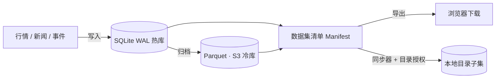

# Design

Firmament 的形态是一块"黑板"（blackboard）：所有写入者把数据挂上同一片空间，所有读取者按自己的路径取用。

## 组件

- **热库**：单实例 SQLite，强制 WAL 模式；启动即建表，`app_meta` 保存 root user 等应用配置。
- **冷库**：Parquet 按数据集前缀存放于专用 S3 桶（实例通过 IAM instance profile 获得该桶读写权限）。
- **清单**：`GET /api/v1/datasets/{id}/manifest` 现场扫描数据集目录，返回路径、大小、SHA-256 与更新时间。导出与同步共用。
- **同步器**：服务端只保存"数据集 + 子目录前缀"的配置记录；真正的文件搬运发生在浏览器。

## 同步协议

1. 浏览器选择目录（File System Access API，`showDirectoryPicker`），授权 `readwrite`。
2. 读取目录内 `.firmament/sync.json`（上次同步的清单）。
3. 对远端清单中每个文件：本地不存在、大小不同、或已记录哈希不同 → 进入下载计划。
4. 下载完成后用 `crypto.subtle` 重算 SHA-256，校验不通过即中止。
5. 清理：上次记录中已消失于远端清单的文件从本地删除；本地其他文件不受影响。
6. 写入新的 `.firmament/sync.json`。

目录句柄通过 IndexedDB 保存，下次同步可复用（只需重新确认权限）。

## 安全

- Auth Mini JWT 校验（audience `firma.ntnl.io`），后端不做登录页。
- Linkit Bot Token 以 AES-256-GCM 加密落库；密钥文件 `~/.firmament/credential.key` 权限 0600。
- 数据集文件读取路径做组件级白名单校验（仅允许普通路径段），杜绝目录穿越。

## 未决

- 冷库的写入管线（归档作业）与 Parquet 查询路径尚未实装，接口已按上面结构预留。
