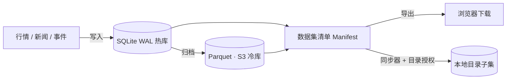

# Design

Firmament 的形态是一块"黑板"（blackboard）：所有写入者把数据挂上同一片空间，所有读取者按自己的路径取用。

## 组件

- **热库**：单实例 SQLite，强制 WAL 模式；启动即建表，`app_meta` 保存 root user 等应用配置。
- **冷库**：Parquet 按数据集前缀存放于 S3 桶（`datasets/{id}/` 前缀，实例通过 IAM instance profile 获得桶读写权限）；由归档作业写入，详见「归档与冷库」。
- **清单**：`GET /api/v1/datasets/{id}/manifest` 现场扫描热文件（数据集目录）与冷文件目录，返回路径、大小、SHA-256、更新时间与层级标记。导出与同步共用。
- **同步器**：服务端只保存"数据集 + 子目录前缀"的配置记录；真正的文件搬运发生在浏览器。

## 同步协议

1. 浏览器选择目录（File System Access API，`showDirectoryPicker`），授权 `readwrite`。
2. 读取目录内 `.firmament/sync.json`（上次同步的清单）。
3. 对远端清单中每个文件：本地不存在、大小不同、或已记录哈希不同 → 进入下载计划。
4. 下载完成后用 `crypto.subtle` 重算 SHA-256，校验不通过即中止。
5. 清理：上次记录中已消失于远端清单的文件从本地删除；本地其他文件不受影响。
6. 写入新的 `.firmament/sync.json`。

目录句柄通过 IndexedDB 保存，下次同步可复用（只需重新确认权限）。

## 发布与写入治理

- **数据集**：root 通过 `POST /api/v1/datasets` 创建（ID 为 slug，落库即生效；目录按需创建）。
- **写 token**：root 通过 `POST /api/v1/write-tokens` 创建，明文只在响应中出现一次，库中仅存 SHA-256 哈希；`last_used_at` 随发布更新，`DELETE` 立即吊销。
- **发布**：`PUT /api/v1/publish/{dataset_id}/{path}` 以写 token（Bearer）鉴权，与 Auth Mini 会话层分离；请求体即文件字节（上限 32 MiB）。路径只允许普通组件且不允许隐藏段；写入先落隐藏临时文件再 rename，保证原子替换。
- **审计**：`publish_events` 记录发布者（token 名称冗余存储，吊销后仍可追溯）、数据集、路径、大小与 SHA-256；root 通过 `GET /api/v1/publish-events` 查看最近记录。

## 归档与冷库

- **归档作业**：root 在数据集上触发（`POST /api/v1/datasets/{id}/archive`，同一数据集同时只允许一个作业）。作业把数据集目录中的表格文件转换为 Parquet（`*.csv` → `*.parquet`，`*.parquet` 直传），上传到 S3 冷库的 `datasets/{id}/` 前缀，校验对象大小与 SHA-256 后移除本地热副本；非表格文件跳过。作业进度记录在 `archive_jobs`。
- **冷目录**：归档成功的对象登记于 `cold_files`；清单 = 本地扫描（热）+ 冷目录（冷），两层对导出与同步呈现相同路径。
- **回源**：请求冷文件时，服务端按需从 S3 流式取回；浏览器下载完成后仍以 SHA-256 校验。
- **配置**：桶与区域存于 `app_meta`（`cold_bucket`、`cold_region`），root 可通过 `GET/PUT /api/v1/cold` 调整。

## 安全

- Auth Mini JWT 校验（audience `firma.ntnl.io`），后端不做登录页。
- Linkit Bot Token 以 AES-256-GCM 加密落库；密钥文件 `~/.firmament/credential.key` 权限 0600。
- 数据集文件读取路径做组件级白名单校验（仅允许普通路径段），杜绝目录穿越。

## 未决

- 冷库的清理与对账（purge、孤儿对象、绕过应用的 S3 直写）尚未实装；大文件仍是整体读入内存；数据集级 tier 与文件级冷热的语义尚未统一。
- 写 token 尚未按数据集限定范围；发布审计尚无保留与轮转策略。
